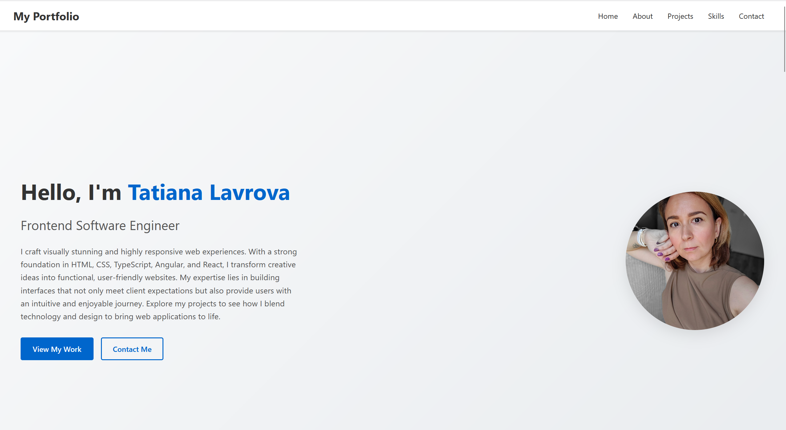

# Tatiana Lavrova's Personal Portfolio

A modern, responsive portfolio website built with React and TypeScript to showcase my projects and professional experience.



## 🚀 Live Demo

Visit the live site: [tlavrova.github.io/personal-portfolio](https://tlavrova.github.io/personal-portfolio/)

## ✨ Features

- **Responsive Design**: Optimized for all device sizes from mobile to desktop
- **Dark/Light Mode**: Toggle between themes with a smooth transition
- **Project Showcase**: Highlighting key projects with descriptions and links
- **Contact Form**: Integrated with Formspree for easy contact
- **Testimonials**: Feedback from colleagues and clients
- **Modern UI**: Clean, professional design with smooth animations

## 🛠️ Built With

- **React** - UI library
- **TypeScript** - Type safety and better developer experience
- **CSS** - Custom styling with responsive design
- **FontAwesome** - Icons
- **Formspree** - Form handling

## 📋 Project Structure

The project follows a modular component-based architecture:

```
src/
├── assets/           # Images and other static assets
├── components/       # React components
│   ├── data/         # Data files for projects and testimonials
│   └── styles/       # Component-specific styles
├── context/          # React context providers (theme)
└── App.tsx           # Main application component
```

## 🚀 Getting Started

### Prerequisites

- Node.js (v14.0.0 or later)
- npm or yarn

### Installation

1. Clone the repository:
   ```bash
   git clone https://github.com/tlavrova/personal-portfolio.git
   cd personal-portfolio
   ```

2. Install dependencies:
   ```bash
   npm install
   ```

3. Start the development server:
   ```bash
   npm start
   ```

4. Open [http://localhost:3000](http://localhost:3000) to view it in the browser.

## 🔧 Available Scripts

- **`npm start`**: Runs the app in development mode
- **`npm test`**: Launches the test runner
- **`npm run build`**: Builds the app for production
- **`npm run deploy`**: Deploys the app to GitHub Pages

## 📱 Responsive Design

The portfolio is fully responsive and optimized for:
- Mobile devices
- Tablets
- Laptops/Desktops

## 🌙 Theming

The application supports both light and dark modes. Theme preferences are saved in local storage for persistent user experience.

## 📄 License

This project is open source and available under the [MIT License](LICENSE).

## 📬 Contact

- **Email**: [tlavrova230@gmail.com](mailto:tlavrova230@gmail.com)
- **LinkedIn**: [linkedin.com/in/tlavrova230](https://linkedin.com/in/tlavrova230)
- **GitHub**: [github.com/tlavrova](https://github.com/tlavrova)

---

Designed & Built by Tatiana Lavrova &copy; 2023
